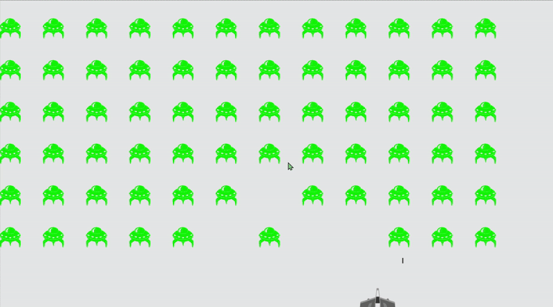

# Alien Invasion Game

A space shooter game built with Pygame, following the project from *Python Crash Course* by Eric Matthes.



## Overview
Alien Invasion is a 2D shooter where the player controls a spaceship and defends against waves of descending aliens. The game features collision detection, and progressive difficulty.

## Features
- Player-controlled spaceship with smooth movement
- Projectile system and shooting mechanics
- Enemy aliens with wave-based spawning
- Collision detection (ship-alien, bullet-alien)
- game stats (start, playing, game over)


## Technologies Used
- **Python 3.11**
- **Pygame 2.6.1**
- **PyInstaller** (for executable)

## Installation & Setup

### Requirements
- Python 3.7+
- Pygame

### Run Locally
```bash
pip install pygame
python alien_invasion.py
```

### Download & Play
Download the `.exe` file from [itch.io](https://5h0gun.itch.io/alien-invasion) and run it directly.

## Controls
- **Arrow Keys** — Move left/right
- **Spacebar** — Shoot
- **Q** — Quit game

## Project Status
**Work in Progress** — Core functionalities present; currently working on [Scoring, Levels, Music and Background]

## Learning Source
This project is based on the *Alien Invasion* project from *Python Crash Course: A Hands-On, Project-Based Introduction to Programming* by Eric Matthes.

## Author
**T'Shara Haynes**
